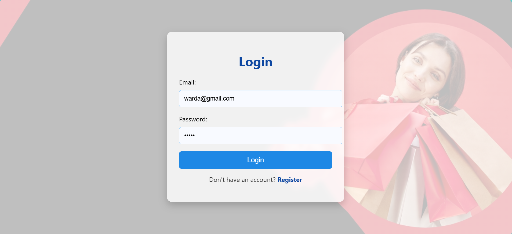
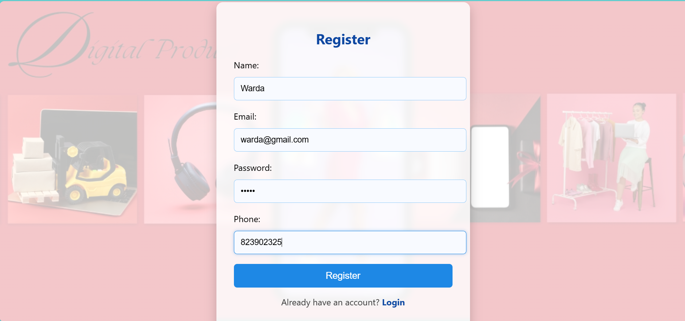

# Ecommerce Store – Frontend Project

This is a semester project developed as part of Database Systems course.

## 🛠 Technologies Used
- HTML5
- CSS3
- JavaScript
- Oracle SQL Database

## ✨ Features
- User Login & Signup
- New user registration with validations
- Products and customer data stored in Oracle Database
- Frontend and database integration
- Clean and user-friendly UI

## 📸 Screenshots
### Home Page

### Login Page

### Registration Page

## 🚀 Learning Outcomes
- Frontend development fundamentals
- Oracle SQL database integration
- Real-world ecommerce workflow understanding
